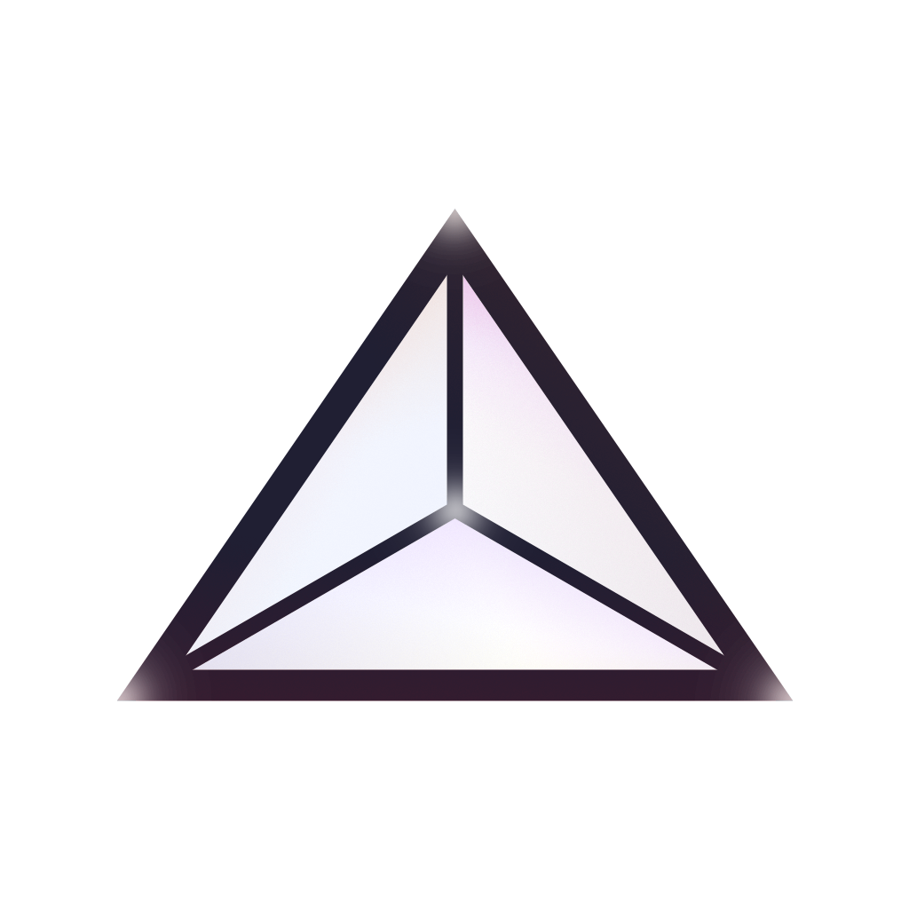

 

© 2025 TheGooberr1. All rights unmentioned within the license that this project is under (AGPL-3.0) are reserved. 

_Powered by magic!_ 

 

### _What is PrismaE?_
> PrismaE has no description yet. My bad guys, I was writing this README late at night. :)

 

### _Information about Qt._
>_This project of mine uses something known as Qt. The license that Qt is under, is LGPL-3.0, while my project is under AGPL-3.0._ 
>_This project is dynamically linked. This means that libraries can be changed at any time, and issues shouldn't show up or whatever (if done correctly)._ 
>_You can view the Qt license within the "Dependencies" folder._ 
>_I don't know why I added this but some clanker ai said to.._ 

  

### _License_
> No description yet. My bad.
